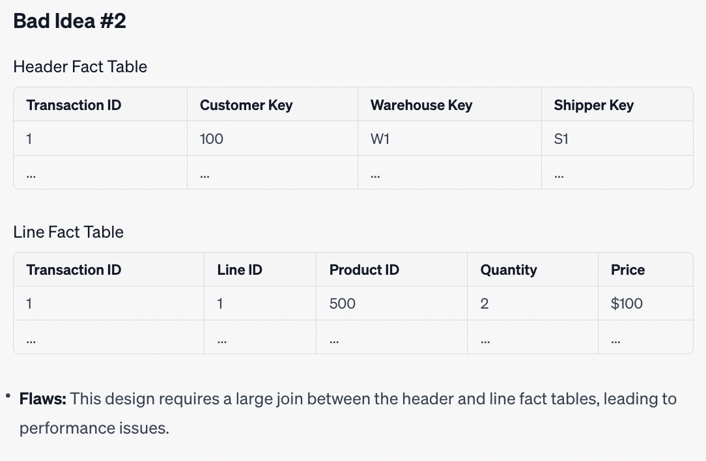

# Lecture 16 Data warehouse & Snowflake Python

## 阅读笔记

## Reference:
Read more [Kimball_The-Data-Warehouse-Toolkit-3rd-Edition](assets/pdf/Kimball_The-Data-Warehouse-Toolkit-3rd-Edition.pdf)

Read more [Glossary of Dimensional Modeling Techniques](https://www.kimballgroup.com/data-warehouse-business-intelligence-resources/kimball-techniques/dimensional-modeling-techniques/) with “official” Kimball definitions for over 80 dimensional modeling concepts

## 阅读笔记
## 1.了解什么是SCD(Slow changing dimension)
聊聊数据仓库中的缓慢变化维度（SCD）
https://blog.csdn.net/nazeniwaresakini/article/details/104220064

Understanding Slowly Changing Dimensions (SCD) in Data Warehousing
https://python.plainenglish.io/understanding-slowly-changing-dimensions-scd-in-data-warehousing-20a566ae3fdd

## 2.图示讲解颗粒度grain
Analytics Engineering Glossary>Data grain
https://docs.getdbt.com/terms/grain

## 3.讲解dimension hierarchy技术:
- Fixed depth positional hierarchies
  
  A fixed depth hierarchy is ... [read more](https://www.kimballgroup.com/data-warehouse-business-intelligence-resources/kimball-techniques/dimensional-modeling-techniques/fixed-depth-hierarchy/)
  
  
  
  
- Slightly ragged/variable depth hierarchies
  
  Slightly ragged hierarchies ... [read more](https://www.kimballgroup.com/data-warehouse-business-intelligence-resources/kimball-techniques/dimensional-modeling-techniques/slightly-ragged-variable-depth-hierarchy/)
  
  
  
  
- Ragged/variable depth hierarchies
  
  如何使用桥接表（Bridge Table）和路径字符串（Pathstring）属性来处理不确定深度的参差不齐的层次结构（Ragged Hierarchies）... [read more](https://www.kimballgroup.com/data-warehouse-business-intelligence-resources/kimball-techniques/dimensional-modeling-techniques/ragged-variable-depth-hierarchy/)

  
  
  
## 4.Fact table 高阶技术:
- [Surrogate key](https://www.kimballgroup.com/data-warehouse-business-intelligence-resources/kimball-techniques/dimensional-modeling-techniques/fact-surrogate-key/)
  
  代理键（Surrogate Keys）在数据仓库设计中是一项非常重要的技术，它用于实现几乎所有维度表的主键。下面的图和表将帮助解释如何使用代理键，并说明它们的一些用途。
  
  
  
- 蜈蚣表 centipede fact table
  
  有些设计者可能会为多对一层次结构的每个级别创建单独的规范化维度，这可能导致所谓的“蜈蚣事实表”（Centipede Fact Table）。下面的图和表将说明这种情况，以及为什么应避免它。
  
  
  
- [Numeric value as attribute](https://www.kimballgroup.com/data-warehouse-business-intelligence-resources/kimball-techniques/dimensional-modeling-techniques/numeric%20-attribute-fact/)
  
  设计者有时可能会遇到不明确属于事实还是维度属性类别的数字值。下面的图表将说明如何处理这些情况，以产品的标准零售价为例。
  
  
  
  
- [Lag/duration facts](https://www.kimballgroup.com/data-warehouse-business-intelligence-resources/kimball-techniques/dimensional-modeling-techniques/lag-duration-fact/)
  
  累积快照事实表捕获多个过程里程碑，每个里程碑都有一个日期外键和可能的日期/时间戳。业务用户经常想要分析这些里程碑之间的延迟或持续时间。有时这些延迟只是日期之间的差异，但其他时候延迟可能基于更复杂的业务规则。
  
  如果管道中有几十个步骤，可能会有数百个可能的延迟。与其强迫用户的查询从日期/时间戳或日期维度外键中计算每个可能的延迟，不如对每个相对于流程起点的步骤存储一次时间延迟。然后，可以将两个步骤之间的每个可能延迟计算为事实表中存储的两个延迟之间的简单减法。
  
  
  
- [Header/line fact table](https://www.kimballgroup.com/2007/10/design-tip-95-patterns-to-avoid-when-modeling-headerline-item-transactions/)
  
  Here are three different approaches to modeling header/line item information in a Data Warehouse/Business Intelligence (DW/BI) environment, and it specifically cites two flawed approaches (Bad Idea #1 and Bad Idea #2) and a recommended structure.
  
  
  

- [Allocated facts](https://www.kimballgroup.com/data-warehouse-business-intelligence-resources/kimball-techniques/dimensional-modeling-techniques/allocated-fact/) 
  
- [Profit and loss fact tables using allocations](https://www.kimballgroup.com/data-warehouse-business-intelligence-resources/kimball-techniques/dimensional-modeling-techniques/profit-loss-fact-table/)

  
  
  
- [Multiple currency facts](https://www.kimballgroup.com/data-warehouse-business-intelligence-resources/kimball-techniques/dimensional-modeling-techniques/multiple-currencies/)
  
  对于记录多种货币的财务交易的事实表，每一行的财务事实应该包含一对列。其中一列表示交易的真实货币中的事实，另一列表示用于整个事实表的单一标准货币中的相同事实。标准货币值是根据货币转换的批准业务规则在ETL过程中创建的。这个事实表还必须具有一个货币维度来识别交易的真实货币。
  
  

- [Multiple units of measure](https://www.kimballgroup.com/data-warehouse-business-intelligence-resources/kimball-techniques/dimensional-modeling-techniques/multiple-units-of-measure/)
  
  一些业务流程要求事实同时以多个度量单位进行陈述。例如，根据业务用户的视角，供应链可能需要将相同的事实报告为托盘、装运箱、零售箱或个别扫描单位。如果事实表包含大量事实，每个事实都必须以所有度量单位表示，则一种方便的技术是以商定的标准度量单位将事实存储在表中一次，但同时还存储标准度量单位与所有其他单位之间的转换系数。这个事实表可以通过视图部署到每个用户群体，使用适当选择的转换系数。转换系数必须驻留在底层事实表行中，以确保视图计算简单且正确，同时最大限度地减少查询复杂性。
  
  
  
  
- [Year-to-date facts](https://www.kimballgroup.com/data-warehouse-business-intelligence-resources/kimball-techniques/dimensional-modeling-techniques/year-to-date-fact/)

  
  

- [利用Multipass SQL避免多个fact table join](https://stackoverflow.com/questions/42629656/how-to-avoid-joins-between-fact-tables-in-a-star-schema)
  
  In a BI (Business Intelligence) application, it's essential to avoid direct SQL joins across fact tables through their foreign keys. Doing so can lead to incorrect results because of uncontrolled cardinality in the join. The proper technique to employ is "drilling across" two fact tables, where separate answer sets are created for each fact table, and then those results are sort-merged based on common attributes.
  
  
  
- [Timespan tracking in fact tables](https://www.kimballgroup.com/data-warehouse-business-intelligence-resources/kimball-techniques/dimensional-modeling-techniques/timespan-fact-table/)
  
  在数据仓库中，事实表主要有三种粒度：事务粒度、周期快照粒度、和累积快照粒度。在某些情况下，为了捕捉事实行有效的时间跨度，可能会添加行生效日期、行到期日期和当前行指示符，就像你在处理类型2的缓慢变化维度时所做的那样。
  
  
  
- [Late arriving facts](https://www.kimballgroup.com/data-warehouse-business-intelligence-resources/kimball-techniques/dimensional-modeling-techniques/late-arriving-fact/)
  
  
  
  
## 5.Dimension table高阶技术：
- [Dimension-to-dimension table joins](https://www.kimballgroup.com/data-warehouse-business-intelligence-resources/kimball-techniques/dimensional-modeling-techniques/dimension-to-dimension-join/)
  
  在数据仓库中，维度（Dimensions）有时会包含对其他维度的引用。这些关系通常可以通过使用外围维度（Outrigger Dimensions）进行建模。但这样做有时会导致基础维度（Base Dimension）的“爆炸式”增长。具体来说，当外围维度发生类型2（Type 2）的变化时，基础维度也必须进行相应的类型2处理。这通常会导致基础维度变得更大和更复杂。
  
  解决方法
  这种爆炸式增长通常可以避免，方法是通过将外围维度的外键放在事实表（Fact Table）而不是基础维度中，从而降级（demote）维度之间的关联。这意味着，如果要找出这两个维度之间的关联，只能通过遍历事实表来实现。但这通常是可以接受的，尤其是当事实表是一个定期快照（Periodic Snapshot）时，因为在这种情况下，所有维度的所有键在每个报告期都是存在的。
  
  
  
  
- [Multivalued dimension & Bridge table](https://www.kimballgroup.com/data-warehouse-business-intelligence-resources/kimball-techniques/dimensional-modeling-techniques/multivalued-dimension-bridge-table/)
  
  在经典的维度模型中，与事实表（Fact Table）连接的每一个维度（Dimension）都有一个与事实表粒度（Grain）一致的单一值。但在某些情况下，一个维度是合法地具有多个值。例如，在医疗保健中，一个接受治疗的病人可能有多个同时出现的诊断。在这些情况下，这个多值维度必须通过一个组维度键（Group Dimension Key）连接到一个桥接表（Bridge Table），该桥接表具有一行用于组中每个同时的诊断。
  
  一个多值的桥接表可能需要基于一个类型2（Type 2）的缓慢变化维度（Slowly Changing Dimension）。例如，实现银行账户和个人客户之间多对多关系的桥接表通常必须基于类型2的账户和客户维度。在这种情况下，为了防止账户和客户之间的错误连接，桥接表必须包括有效和过期的日期/时间戳，并且请求应用程序必须限制桥接表到一个特定的时刻，以产生一个一致的快照。
  
  
  
  结论
  多值维度需要特别的设计和实施考虑，尤其是当它们是基于类型2的缓慢变化维度时。通过使用桥接表和时间戳，可以在特定时间点获得一致和准确的数据快照。这是一种高级的数据仓库模式，需要特别的注意和计划。
  
- [Behaviour tag time series](https://www.kimballgroup.com/data-warehouse-business-intelligence-resources/kimball-techniques/dimensional-modeling-techniques/behavior-tag-series-attribute/)
  
  它可以方便地进行复杂的同时查询。这样的设计使得我们可以更容易地追踪和分析客户行为的变化趋势，而不仅仅是单一的数值指标。
  
  

- [Behaviour study group](https://www.kimballgroup.com/data-warehouse-business-intelligence-resources/kimball-techniques/dimensional-modeling-techniques/behavior-study-group/)
  
  复杂行为分析的结果可以被捕获在一个简单的表中，称为"研究组"（Study Group），该表仅由客户的持久键（Durable Keys）组成。
  
  
  
  
- [Aggregated Facts as Dimension Attributes](https://www.kimballgroup.com/data-warehouse-business-intelligence-resources/kimball-techniques/dimensional-modeling-techniques/aggregated-fact-attribute/)
  
  商业用户通常对基于汇总性能指标来限制客户维度感兴趣，例如，筛选在去年或可能在客户的整个生命周期中花费超过某一特定美元金额的所有客户。选定的汇总事实可以放置在一个维度中作为用于限制的目标以及用于报告的行标签。这些指标通常以分段范围的形式出现在维度表中。代表汇总性能指标的维度属性增加了ETL处理的负担，但减轻了BI层面的分析负担。
  
  
  
  结论
  将汇总性能指标（如累计消费金额、消费等级等）包含在客户维度表中，虽然增加了ETL处理的复杂性，但在BI分析中提供了方便。商业用户可以轻松地对这些汇总指标进行筛选和报告，而无需进行复杂的SQL查询或数据处理。这种设计也可以适应不断变化的商业需求，并为未来的分析提供了灵活性。
  
- [Dynamic value banding](https://www.kimballgroup.com/data-warehouse-business-intelligence-resources/kimball-techniques/dimensional-modeling-techniques/dynamic-value-banding/)
  
- [Text comments](https://www.kimballgroup.com/data-warehouse-business-intelligence-resources/kimball-techniques/dimensional-modeling-techniques/text-comment/)
  
- Multiple time zones
- Step dimension
- Hot swappable dimension
- Abstract generic dimensions
- Audit dimension
- Late arriving
- Supertype and subtype schemas for heterogeneous products
- Real time fact table
- Error event schemas