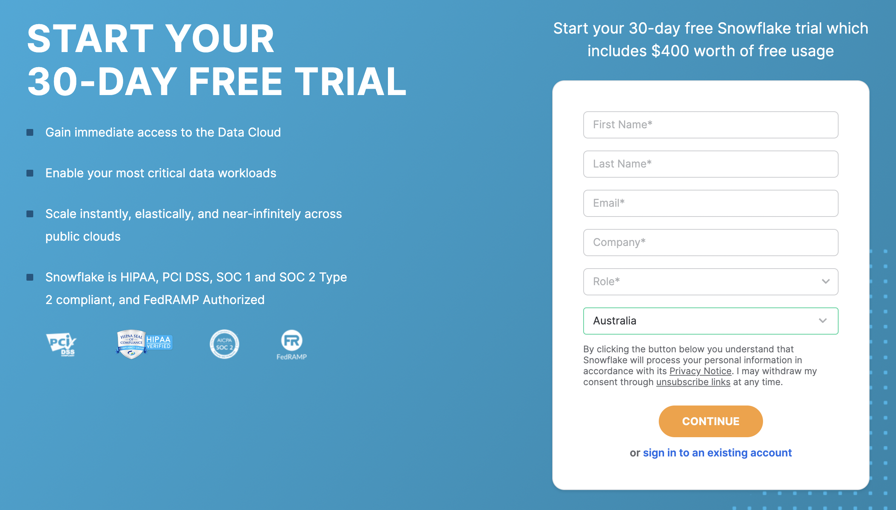

# Tutorial 04 Snowflake 注册，界面介绍，操作使用

# 课堂笔记
## 1. register snowflake 30-day free trial

## 2. introduce snowflake GUI

## 3. load data into snowflake
1. check the input source in aws s3 bucket (e.g. csv, txt)
2. create and run target table sql 
3. create file format 
4. put the file into stage
5. copy data into table